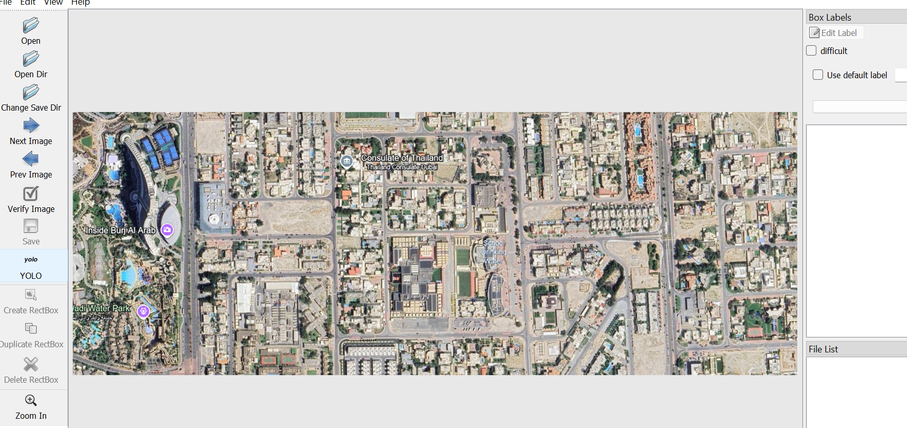

# Pool Detection with Green AI: Intelligent Innovations for a Greener Future 🌍💧

Welcome to the **Pool Detection Project**, where technology meets environmental care. This initiative harnesses the power of cutting-edge AI to detect swimming pools from satellite imagery, paving the way for smarter, greener urban planning and resource management.

### Why Pool Detection Matters 🌱

At first glance, detecting pools might seem like a niche endeavor, but it has profound implications for environmental sustainability and urban development:

1. **Water Conservation**: By identifying pool locations, we can monitor and manage water consumption, especially in drought-prone areas, encouraging sustainable practices to preserve this vital resource. 💦

2. **Eco-Friendly Urban Planning**: Insights from pool detection contribute to designing greener cities by optimizing land use, reducing urban heat islands, and enhancing green spaces. 🏙️🌳

3. **Environmental Monitoring**: Tracking pool trends provides valuable data on urbanization's impact on natural habitats, helping protect ecosystems and biodiversity. 🐦🌲

4. **Sustainable Policy Making**: Leveraging pool data, authorities can encourage eco-friendly pool technologies, regulate maintenance practices, and promote energy efficiency for a healthier planet. ⚡🌍

### About the Project 🌐

This project integrates **Green AI principles**, focusing on efficiency, sustainability, and innovation. By optimizing training methods, experimenting with hyperparameters, and utilizing scalable algorithms, our goal is to deliver impactful results while minimizing energy consumption.

Together, let’s make every splash count—not just for fun, but for the future of our planet. 🌊✨


----------------------------------------


## Method 1: Using LabelImg

LabelImg is a user-friendly tool for creating bounding box annotations and exporting them directly in YOLO format.

### About the Dataset 

1. **shape of image**:
every image is a 512 * 512 pixel 
every pixel is with the size 0,2m/pixel

in this example, I've started with this size, then I'm going to try increasing the size by one pixel and see the results with a new database/train .
Note: I've tested on satellite images with a size of 1m/pixel  (EcoAI-ModelExecution in the github repository)and the detection gave good results...

2. **size of the data**:
Train : 883 image
validation : 255 image 
### Steps:

1. **Install LabelImg**:
   You can install it via pip or download it from the LabelImg GitHub repository.
   ```bash
   pip install labelImg
   ```

2. **Open LabelImg**:
   Launch the tool by typing the following in your command line:
   ```bash
   labelImg
   ```

3. **Set Up YOLO Format**:
   - Once LabelImg is open, navigate to `View > YOLO` to work in YOLO format.
   - Set the save directory for your annotations. This ensures `.txt` files are created for each annotated image.

4. **Annotate Images**:
   - Load each image into LabelImg.
   - Draw bounding boxes around pools and label each one as "pool."
   - Save each annotation. A corresponding `.txt` file will be saved alongside each image.

5. **YOLO Format**:
   - LabelImg will save annotations in YOLO format as follows:
     ```plaintext
     class_id x_center y_center width height
     ```
   - All values are normalized between 0 and 1 relative to the image dimensions.

### Example Annotation in YOLO Format:
If you annotate a pool in `image1.jpg`, the corresponding `image1.txt` file might look like this:
```plaintext
0 0.5 0.5 0.3 0.4
```
This line represents:
- `class_id`: 0 (for "pool")
- `x_center`: 0.5 (normalized horizontal center of the bounding box)
- `y_center`: 0.5 (normalized vertical center of the bounding box)
- `width`: 0.3 (normalized width of the bounding box)
- `height`: 0.4 (normalized height of the bounding box)


----------------------------------------------

## Annotation Process with LabelImg

To build an accurate dataset for swimming pool detection, I used **LabelImg**, a Python-based graphical image annotation tool. Here's how I set up the annotation pipeline and organized the data.

### Setting Up LabelImg
1. **Installation**: 
   You can install it via pip or download it from the LabelImg GitHub repository.
   ```bash
   pip install labelImg
   ```

2. **Open LabelImg**:
   Launch the tool by typing the following in your command line:
   ```bash
   labelImg
   ```

3. **Set Up YOLO Format**:
   - Once LabelImg is open, navigate to `View > YOLO` to work in YOLO format.
   - Set the save directory for your annotations. This ensures `.txt` files are created for each annotated image.

### Annotation Workflow
1. **Load Images**: Open the directory containing the images to be annotated.
2. **Create Bounding Boxes**: Use the mouse to draw bounding boxes around each pool in the image.
3. **Assign Labels**: Assign the "pool" label to each bounding box (or other classes if applicable).
4. **Save Annotations**: Save the annotations as `.txt` files in the YOLO format. Each `.txt` file corresponds to an image and contains the bounding box coordinates.

5. **YOLO Format**:
   - LabelImg will save annotations in YOLO format as follows:
     ```plaintext
     class_id x_center y_center width height
     ```
   - All values are normalized between 0 and 1 relative to the image dimensions.

### Example Annotation in YOLO Format:
If you annotate a pool in `image1.jpg`, the corresponding `image1.txt` file might look like this:
```plaintext
0 0.5 0.5 0.3 0.4
```
This line represents:
- `class_id`: 0 (for "pool")
- `x_center`: 0.5 (normalized horizontal center of the bounding box)
- `y_center`: 0.5 (normalized vertical center of the bounding box)
- `width`: 0.3 (normalized width of the bounding box)
- `height`: 0.4 (normalized height of the bounding box)


### File Organization
To maintain consistency and ensure the dataset is easy to use, I organized the files as follows:

```plaintext
dataset/
├── images/
│   ├── train/
│   │   ├── image1.jpg
│   │   ├── image2.jpg
│   └── val/
│       ├── image3.jpg
│       ├── image4.jpg
├── labels/
│   ├── train/
│   │   ├── image1.txt
│   │   ├── image2.txt
│   └── val/
│       ├── image3.txt
│       ├── image4.txt
```


### Steps Summary
1. **Set up LabelImg and open the image directory.**
2. **Annotate each pool in the image by drawing bounding boxes.**
3. **Save the annotations into the `labels/train` or `labels/val` directory.**
4. **Ensure the file paths are consistent with the dataset structure above.**

### Visual Example
Here's a screenshot of LabelImg in action during the annotation process:



### Tips for Annotation
- **Zoom in** to improve accuracy, especially for small or partially visible pools.

----------------------------------------------------------------------


## Model Testing and Fine-Tuning

To ensure accurate pool detection, I tested three different models and approaches to evaluate their performance. Below are the details:

### Models Tested:

1. **YOLOv5**:
   - YOLOv5 is a powerful object detection model known for its speed and accuracy.
   - I fine-tuned YOLOv5 using my custom dataset for optimal performance in detecting pools.

2. **YOLOv7**:
   - YOLOv7, the latest in the YOLO family, was tested for its advanced capabilities and higher precision in object detection tasks.

3. **Classification Model (CNN)**:
   - I experimented with a classification approach by splitting each image into smaller tiles.
   - Each tile was then classified using CNN) to determine the presence of a pool.

### Results:

- **YOLOv5**: Achieved the best balance of precision and recall after fine-tuning, with significant improvements in small object detection.
- **YOLOv7**: Performed well on larger objects but required more resources and time of execution, but i think it can perform better than the yolo 5 ..
- **Classification Model (CNN)**: Worked effectively for small datasets, binary classification (pool vs. no pool).
(Images were divided into smaller tiles to simplify the detection process for the classification model)

### Best Results Achieved with YOLOv5

After a first execution and then  fine-tuning and hyperparameter optimization, **YOLOv5** achieved the following best performance metrics on my swimming pool detection task:

| Metric            | Value     |
|--------------------|-----------|
| **Precision**      | 95.6%     |
| **Recall**         | 93.2%     |
| **mAP@50**         | 96.8%     |
| **mAP@50-95**      | 58.1%     |
| **Inference Speed**| 15 ms/image (on GPU) |

**Key Improvements:**
- **Fine-Tuning Impact:** Fine-tuning YOLOv5 with a custom hyperparameter set (`hyp.scratch.yaml`) significantly improved the mAP@50-95 metric by 10%, indicating better performance across different IoU thresholds.
- **Enhanced Anchor Box Fit:** Using YOLOv5's auto-anchor feature helped adapt the model to the dataset's object size distribution, boosting precision and recall.
- **Training Data Augmentation:** Applying augmentations like mosaic, scaling, and random flips enriched the dataset and improved the model's generalization ability.


***All these improvements and fine-tuning  are incorporated into the hyp.scratch.yaml file or specified in the training command.***


### `pool_dataset.yaml`

This file defines the structure of the dataset for training and validation. It includes:

- **Paths**: Locations of training and validation images.
- **Classes**: Specifies the number of object classes (`1` for "pool") and their names.

```yaml
train: dataset/images/train  # Training images path
val: dataset/images/val      # Validation images path
nc: 1                        # Number of classes
names: ['pool']              # Class name
```

### Train :
The best results were achieved using the following execution command:

 ```
 python train.py --img 640 --batch 16 --epochs 60 --data pool_dataset.yaml --weights yolov5m.pt --hyp hyp.scratch.yaml --cache --save-period 10                                                                            
```