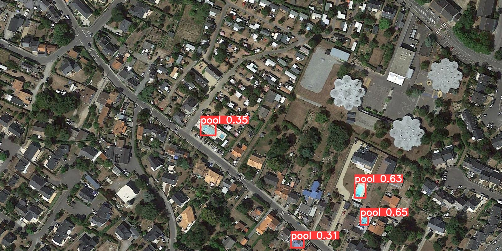

# Pool Detection with Green AI: Intelligent Innovations for a Greener Future 🌍💧

Welcome to the **Pool Detection Project Model-Execution-Part**, where technology meets environmental care. This initiative harnesses the power of cutting-edge AI to detect swimming pools from satellite imagery, paving the way for smarter, greener urban planning and resource management.


## Mdel Execution :

The detection output will include:  
- **Images with Bounding Boxes**: The detected objects will be highlighted with bounding boxes on the images.  
- **A TXT File**: This file contains the coordinates of the bounding boxes within the image.


### Command of Execution

 ```
python detect.py --weights runs/train/exp2/weights/best.pt --img 640 --source \new --save-txt
                                                                      
```
### Results 

The results will be saved in the 'runs\detect\exp' directory

1. Here's an exemple of the detection:



2. Original YOLO output file (`labels/*.txt`).
'''
<class_id> <x_center> <y_center> <width> <height>
'''

3. A new file (`labels/*_pixels.txt`) containing the bounding box coordinates in ***pixel format***.


